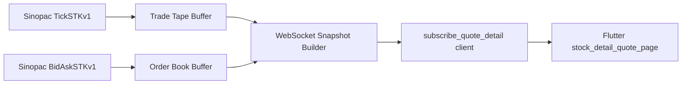

# Sinopac Native Quote Detail Design

**Date:** 2026-04-12  
**Scope:** 將 [E:\claude code test\sinopac_bridge.py](E:\claude code test\sinopac_bridge.py) 的 `最佳五檔 / 逐筆成交` 改成直接維護永豐原生資料 buffer，再透過既有 WebSocket 協議推送給 Flutter。

---

## Goal

把目前 `subscribe_quote_detail` 這條資料鏈從「後端用 tick 狀態推導快照」改成「後端維護永豐原生五檔與原生逐筆成交 buffer」，讓 Flutter 個股頁的：

- `ORDER_BOOK_SNAPSHOT`
- `TRADE_TAPE_SNAPSHOT`

都來自 Sinopac / Shioaji 原生回呼資料，而不是合成或推導版資料。

---

## Non-Goals

這一輪不做以下事情：

- 不改 Flutter 端 WebSocket 協議名稱或 payload 外形
- 不新增 HTTP API
- 不改 `session_bars / history_bars` 的資料來源
- 不補 `開 / 高 / 低 / 收 / 量` 頂部摘要的即時資料綁定
- 不支援同一連線同時訂閱多個 symbol 的個股明細
- 不做增量 patch 推播，仍採完整快照推播

---

## Current Problem

目前 [E:\claude code test\sinopac_bridge.py](E:\claude code test\sinopac_bridge.py) 的 `quote_detail` 來源有兩個結構問題：

1. `ORDER_BOOK_SNAPSHOT` 是用當前價位與價階推導出來的合成五檔，不是永豐原生 `BidAskSTKv1`
2. `TRADE_TAPE_SNAPSHOT` 是在 `_offer_tick()` 內根據標準化 tick payload 組裝，而不是直接保留原生逐筆成交 buffer

結果是 Flutter 端雖然已經接上同一條 WebSocket，但五檔與明細資料來源不夠乾淨，無法宣稱是原生行情細節。

---

## Design Summary

採用「全原生緩衝 + 協議不變」：

- 五檔：由 Shioaji 原生 `BidAskSTKv1` callback 更新 buffer
- 逐筆成交：由 Shioaji 原生 `TickSTKv1` callback 更新 buffer
- WebSocket 訂閱協議維持：
  - `subscribe_quote_detail`
  - `unsubscribe_quote_detail`
- WebSocket 推送協議維持：
  - `ORDER_BOOK_SNAPSHOT`
  - `TRADE_TAPE_SNAPSHOT`

也就是說，Flutter 端不需要改協議，只會收到更正確的資料內容。

---

## Data Flow



---

## Backend Changes

### 1. Native order book buffer

在 [E:\claude code test\sinopac_bridge.py](E:\claude code test\sinopac_bridge.py) 內新增原生五檔狀態容器：

- `self._order_book_buffers: dict[str, dict[str, Any]]`

每個 symbol 的 buffer 至少保存：

- `symbol`
- `timestamp`
- `asks`: 5 筆
- `bids`: 5 筆

每筆欄位：

- `level`
- `price`
- `volume`

資料來源必須直接來自 `BidAskSTKv1` callback，不得再從現價推導出價階。

### 2. Native trade tape buffer

保留既有：

- `self._trade_tape_buffers: dict[str, deque[dict[str, Any]]]`

但寫入來源改為原生 `TickSTKv1` callback，不再由 `_offer_tick()` 根據標準化 payload 回填。

每筆資料保持目前 Flutter 端可讀的形式：

- `time`
- `price`
- `volume`
- `side`

其中 `side` 判斷規則：

- `price > previous_price` -> `outer`
- `price < previous_price` -> `inner`
- 否則 -> `neutral`

### 3. Quote subscriptions

在 `_login_and_subscribe_sync()` 內，個股訂閱從目前只訂 `QuoteType.Tick` 改成：

- `QuoteType.Tick`
- `QuoteType.BidAsk`

若 `BidAsk` 訂閱失敗：

- 記錄 warning
- 不中止整體 collector 啟動
- 該 symbol 的五檔快照保持空列表

### 4. Callback binding

現有版本的 Shioaji 已確認提供：

- `api.quote.set_on_tick_stk_v1_callback(...)`
- `api.quote.set_on_bidask_stk_v1_callback(...)`

因此這一輪優先使用 `set_on_*_callback` 方式綁定，而不是 decorator-only 假設。

### 5. Snapshot builders

保留既有方法名稱：

- `_build_order_book_snapshot(symbol)`
- `_build_trade_tape_snapshot(symbol)`

但實作改為：

- `_build_order_book_snapshot(symbol)` 直接讀原生五檔 buffer
- `_build_trade_tape_snapshot(symbol)` 直接讀原生逐筆 buffer

若尚未收到任何 `BidAskSTKv1`：

- `asks = []`
- `bids = []`

若尚未收到任何 `TickSTKv1`：

- `rows = []`

不再偽造五檔。

---

## WebSocket Contract

這一輪不修改既有 Flutter 協議。

### Client -> Server

```json
{"type":"subscribe_quote_detail","symbol":"2330"}
```

```json
{"type":"unsubscribe_quote_detail","symbol":"2330"}
```

### Server -> Client

```json
{
  "type": "ORDER_BOOK_SNAPSHOT",
  "symbol": "2330",
  "timestamp": 1712900000000,
  "asks": [
    {"level": 1, "price": 780.0, "volume": 342}
  ],
  "bids": [
    {"level": 1, "price": 779.0, "volume": 664}
  ]
}
```

```json
{
  "type": "TRADE_TAPE_SNAPSHOT",
  "symbol": "2330",
  "timestamp": 1712900000000,
  "rows": [
    {"time": "13:29:58", "price": 780.0, "volume": 3, "side": "outer"}
  ]
}
```

---

## Runtime Behavior

### Subscription lifecycle

- Flutter 開啟個股頁後送 `subscribe_quote_detail`
- 後端記錄該 websocket 對應的 symbol
- 後端立即回送當前：
  - `ORDER_BOOK_SNAPSHOT`
  - `TRADE_TAPE_SNAPSHOT`
- 後續該 symbol 有新原生資料時，再推送完整快照
- Flutter 離頁時送 `unsubscribe_quote_detail`

### Single-symbol constraint

同一 websocket 連線在任一時刻只維護一個 `quote_detail` symbol。

後送新 symbol 訂閱時：

- 直接覆蓋該 websocket 的舊 symbol 訂閱

---

## Failure Handling

### Missing BidAsk data

如果永豐原生五檔尚未到達或該版本回呼不可用：

- `ORDER_BOOK_SNAPSHOT` 照常可送
- 但 `asks / bids` 為空列表

### Missing Tick data

如果原生 tick 尚未到達：

- `TRADE_TAPE_SNAPSHOT.rows = []`

### Client disconnect

websocket 中斷時：

- 自動移除該 client 的 `quote_detail` 訂閱
- 不保留孤兒訂閱狀態

---

## Testing Strategy

採 TDD。

### Python tests

在 [E:\claude code test\test_sinopac_bridge.py](E:\claude code test\test_sinopac_bridge.py) 補至少以下情境：

1. 原生 bid/ask callback 更新 buffer 後，`ORDER_BOOK_SNAPSHOT` 反映 callback 內容
2. 原生 tick callback 更新 buffer 後，`TRADE_TAPE_SNAPSHOT` 反映 callback 內容
3. 尚未收到 bid/ask 時，五檔快照為空列表，不再出現合成價階
4. `subscribe_quote_detail` 後立即送出現有快照
5. `unsubscribe_quote_detail` 後停止後續 quote detail 推播

### Regression checks

必須確認這些既有能力不被破壞：

- `PAPER_PORTFOLIO`
- `session_bars`
- `history_bars`
- `paper_trade`

---

## Acceptance Criteria

以下條件全部成立才算完成：

1. [E:\claude code test\sinopac_bridge.py](E:\claude code test\sinopac_bridge.py) 不再用現價推導五檔
2. `ORDER_BOOK_SNAPSHOT` 來自原生 `BidAskSTKv1`
3. `TRADE_TAPE_SNAPSHOT` 來自原生 `TickSTKv1`
4. Flutter 端無需修改協議即可顯示原生五檔與逐筆
5. `pytest -q` 全綠
6. `python -m py_compile run.py sinopac_bridge.py` 通過

---

## Risks

### Shioaji callback field shape differences

不同 Shioaji 版本的 `BidAskSTKv1 / TickSTKv1` 欄位名稱可能有差異，因此實作時需要先在測試中以 fake objects 鎖定我們的讀取方式，再在真 collector 內做防守式欄位解析。

### BidAsk availability differences

部分合約或環境可能拿不到原生五檔。第一版接受這種情況，並回傳空五檔，而不是合成資料。

---

## Recommendation

這一輪完成後，Flutter 個股頁的 `最佳五檔 / 分時明細` 就可以明確標示為「永豐原生行情細節」，而不是 collector 推導版。下一輪若要補強，再處理頂部 `開 / 高 / 低 / 收 / 量` 的即時摘要綁定。
